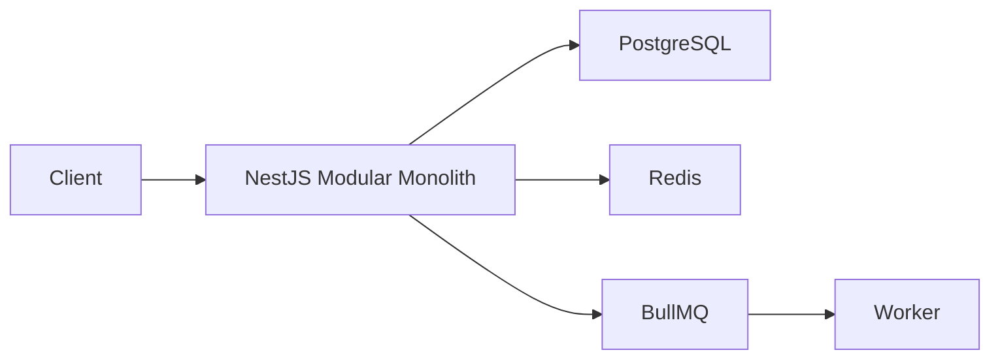
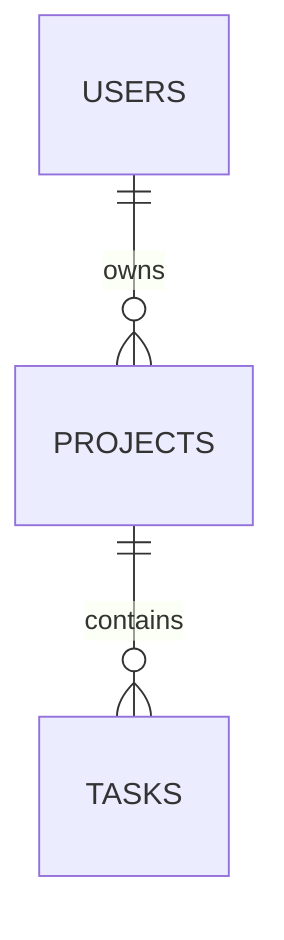

# NestJS Backend Internship Challenge

REST API modular untuk authentication, Project, dan Task dengan PostgreSQL,
JWT ownership, structured logging, Redis cache-aside, BullMQ, dokumentasi
OpenAPI/Postman, Docker, dan quality checks.

## Status

**Final - Submission Ready**

## Cakupan Requirement

- authentication JWT dengan bcrypt;
- Project CRUD dan nested Task CRUD;
- ownership dan private-resource `404`;
- validation, serialization, dan error contract;
- PostgreSQL migration dan relation;
- Pino logging, request ID, redaction, Helmet, CORS, dan throttling;
- health/readiness;
- Redis Project Detail cache;
- BullMQ Task activity;
- Swagger/OpenAPI dan Postman;
- multi-stage Docker image dan unified Compose;
- GitHub Actions untuk quality, E2E, integration, dan Docker;
- architecture overview dan ADR;
- demo data lokal yang aman dan demo verification.

## Teknologi

- Node.js 22, TypeScript, NestJS 11
- PostgreSQL 17, TypeORM
- Passport JWT, bcrypt
- Redis 7.4, ioredis, BullMQ
- Pino, Helmet, Nest Throttler
- Swagger/OpenAPI 3, Postman
- Jest, Supertest
- Docker, Docker Compose, GitHub Actions

## Quick Start dengan Docker

```bash
docker compose -f compose.yml build
docker compose -f compose.yml run --rm migrate
docker compose -f compose.yml up -d app
docker compose -f compose.yml ps
```

Endpoint lokal:

- API: `http://localhost:3000/api/v1`
- Swagger UI: `http://localhost:3000/api/docs`
- OpenAPI JSON: `http://localhost:3000/api/docs-json`
- Liveness: `http://localhost:3000/health`
- Readiness: `http://localhost:3000/health/ready`

Stop stack:

```bash
docker compose -f compose.yml down
```

Nilai Compose adalah credential lokal aman untuk evaluator, bukan konfigurasi
production. Ganti `JWT_SECRET` dan credential database untuk penggunaan
non-lokal.

## Pemenuhan Challenge

- Related CRUD: Project CRUD dan nested Task CRUD.
- PostgreSQL: data disimpan di PostgreSQL dengan TypeORM migration.
- JWT authentication: register, login, JWT guard, dan `/auth/me`.
- E2E token testing: skenario token hilang, malformed, invalid, expired, user
  hilang, dan token valid.
- Modular Layered Architecture: Controller -> Service -> Repository.
- Swagger dan Postman documentation tersedia untuk mencoba API.

## Development Lokal

```bash
npm ci
npm run database:start
npm run redis:start
npm run migration:run
npm run start:dev
```

Focused Compose PostgreSQL dan Redis tetap tersedia. Unified `compose.yml`
adalah workflow delivery yang disarankan dan menghindari orphan warning.

## Environment

Salin `.env.example` menjadi `.env` lokal. File `.env` diabaikan Git dan tidak
disalin ke Docker image.

Kelompok konfigurasi:

- aplikasi: `NODE_ENV`, `PORT`, `API_PREFIX`;
- PostgreSQL: `DATABASE_*`;
- JWT: `JWT_SECRET`, `JWT_EXPIRES_IN_SECONDS`;
- logging/security: `LOG_*`, `CORS_ORIGINS`, `REQUEST_BODY_LIMIT`,
  `AUTH_THROTTLE_*`;
- Redis: `REDIS_*`, `CACHE_ENABLED`, `CACHE_TTL_SECONDS`, `QUEUE_ENABLED`.

Boolean, port, TTL, timeout, namespace, body limit, dan CORS origins divalidasi
saat startup.

## Migration

Migration tidak berjalan otomatis saat aplikasi dimulai.

Lokal:

```bash
npm run migration:show
npm run migration:run
npm run migration:revert
```

Docker:

```bash
docker compose -f compose.yml run --rm migrate
```

## API Documentation

- [Swagger UI](http://localhost:3000/api/docs)
- [OpenAPI JSON](http://localhost:3000/api/docs-json)
- [Authentication](docs/api/authentication.md)
- [Project dan Task](docs/api/projects-and-tasks.md)
- [Error Contract](docs/api/error-contract.md)
- [Runtime](docs/operations/runtime.md)

Swagger memakai route dan request DTO yang sama dengan aplikasi. Protected
route mendeklarasikan Bearer JWT dan dokumentasi mencakup schema response,
pagination, enum, nullable field, Project Detail Tasks, error, serta request
ID.

## Postman

Import:

1. `docs/postman/nestjs-backend-internship-challenge.postman_collection.json`
2. `docs/postman/local.postman_environment.json`

Pilih environment lokal, lalu jalankan folder Health, Authentication,
Projects, dan Tasks secara berurutan. Script menyimpan `accessToken`, `userId`,
`projectId`, dan `taskId`. Token yang dikomit selalu kosong.

Validasi:

```bash
npm run docs:validate
```

## Demo Lokal

Demo data tidak dibuat otomatis saat aplikasi startup. Jalankan migration dan
pastikan aplikasi, PostgreSQL, serta Redis sudah berjalan.

Seed demo data:

```bash
DEMO_USER_PASSWORD=<password-lokal> npm run demo:seed
```

Opsional: set `DEMO_USER_EMAIL` untuk mengganti email default
`demo.backend@example.test`. Tidak ada default password.

Verifikasi demo melalui public HTTP API:

```bash
DEMO_USER_PASSWORD=<password-lokal> npm run demo:verify
```

Reset demo data lokal:

```bash
DEMO_RESET_CONFIRM=RESET_LOCAL_DEMO_DATA npm run demo:reset
```

Reset hanya menghapus demo user dan Project/Task milik demo user. Command ini
menolak production, tidak melakukan truncate, tidak menghapus migration table,
dan tidak memakai Redis `FLUSHALL` atau `FLUSHDB`.

## Endpoint

```text
POST /api/v1/auth/register
POST /api/v1/auth/login
GET  /api/v1/auth/me

POST   /api/v1/projects
GET    /api/v1/projects
GET    /api/v1/projects/:projectId
PATCH  /api/v1/projects/:projectId
DELETE /api/v1/projects/:projectId

POST   /api/v1/projects/:projectId/tasks
GET    /api/v1/projects/:projectId/tasks
GET    /api/v1/projects/:projectId/tasks/:taskId
PATCH  /api/v1/projects/:projectId/tasks/:taskId
DELETE /api/v1/projects/:projectId/tasks/:taskId

GET /health
GET /health/ready
GET /api/docs
GET /api/docs-json
```

## Arsitektur

Aplikasi tetap modular monolith. Setiap domain memiliki controller, service,
repository, DTO, dan persistence boundary. PostgreSQL adalah source of truth;
Redis cache dan BullMQ bersifat sekunder.



Detail dan diagram lengkap:

- [Architecture Overview](docs/architecture/overview.md)
- [ADR 0001: Modular Layered Architecture](docs/adr/0001-use-modular-layered-architecture.md)
- [ADR 0002: PostgreSQL dan TypeORM](docs/adr/0002-use-postgresql-and-typeorm.md)
- [ADR 0003: Namespace Redis dan BullMQ](docs/adr/0003-isolate-redis-cache-and-bullmq-namespaces.md)

## ERD



Project deletion melakukan cascade ke Tasks. Project Detail memuat Tasks
melalui explicit join tanpa query per Task.

## Logging, Cache, dan Queue

Pino mencatat JSON terstruktur dengan request ID dan menyensor credential.
Project Detail memakai owner-scoped cache-aside:

```text
<namespace>:<environment>:cache:project:<userId>:<projectId>
```

BullMQ memakai prefix terpisah:

```text
<namespace>:<environment>:bull
```

Queue `task-activity` menghasilkan `TASK_CREATED` dan
`TASK_STATUS_CHANGED`. Job memiliki bounded retry/backoff dan retention.

## Docker

`Dockerfile` memakai multi-stage build, `npm ci`, production dependencies
saja, dan runtime user non-root. Image tidak membawa `.env`, test, coverage,
docs cache, Git metadata, atau local `node_modules`.

`compose.yml` menyediakan app, PostgreSQL, Redis, dan one-shot migration.
PostgreSQL dan Redis bind ke loopback untuk workflow lokal.

## CI

`.github/workflows/ci.yml` berjalan pada push dan pull request ke `main`:

- Quality and coverage
- PostgreSQL E2E
- Redis and BullMQ integration
- Docker and Compose

Semua job wajib berhasil, memakai timeout, dependency cache, pinned major
official actions, dan tidak memakai `continue-on-error`.

## Testing dan Coverage

```bash
npm run verify
npm run verify:full
```

Perintah individual:

```bash
npm run format:check
npm run lint
npm run typecheck
npm run build
npm test
npm run test:cov
npm run docs:validate
npm run test:e2e -- --detectOpenHandles
npm run test:integration -- --detectOpenHandles
```

Coverage gate global:

| Metric     | Minimum |
| ---------- | ------: |
| Statements |     50% |
| Branches   |     52% |
| Functions  |     39% |
| Lines      |     49% |

Baseline terukur setelah Swagger adalah 51.11% statements, 52.46% branches,
39.52% functions, dan 50.04% lines. DTO decorator, Nest module/bootstrap,
entity metadata, migration, dan integration-heavy infrastructure ikut dihitung
oleh Jest; business service utama memiliki coverage lebih tinggi dan perilaku
runtime juga diuji lewat E2E/integration.

## Security Decisions

- password di-hash bcrypt dan tidak dikembalikan;
- JWT secret tervalidasi dan tidak dikomit;
- ownership diterapkan pada query Project dan parent Project;
- validation menolak unknown property;
- Helmet, explicit CORS, body limit, dan auth throttling aktif;
- authorization, cookie, password, hash, token, dan credential log disensor;
- container berjalan non-root;
- Redis tidak memakai broad flush atau wildcard cleanup.

## Trade-off

Modular monolith dipilih untuk transaksi lokal, deployment sederhana, dan
scope challenge. Cache/queue meningkatkan operasional tanpa menjadikan Redis
source of truth. Throttling masih in-memory per instance.

## Known Limitations

- hanya access token, tanpa refresh-token rotation;
- satu aplikasi modular monolith;
- commit PostgreSQL dan enqueue BullMQ tidak atomik;
- tidak ada transactional outbox;
- tidak ada distributed tracing;
- tidak ada complex RBAC;
- tidak ada production secret-management system.

## Future Improvements

Untuk production, pertimbangkan secret manager, distributed throttling,
transactional outbox, tracing, backup/restore, dan deployment platform
terkelola.
