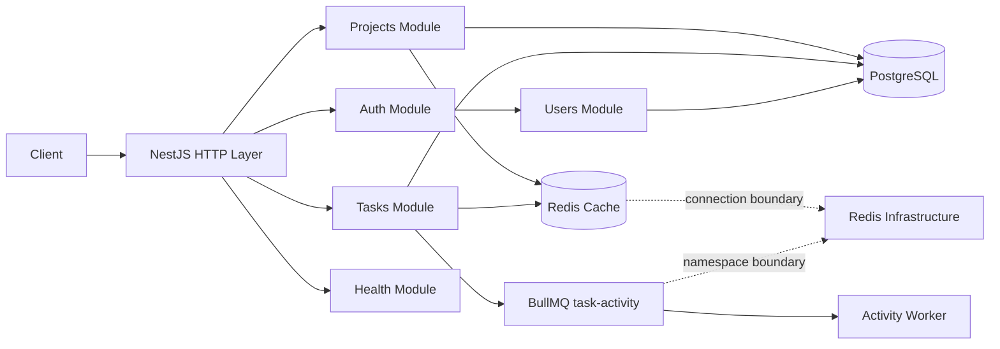
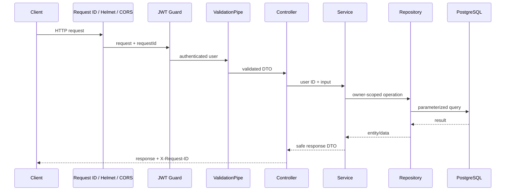
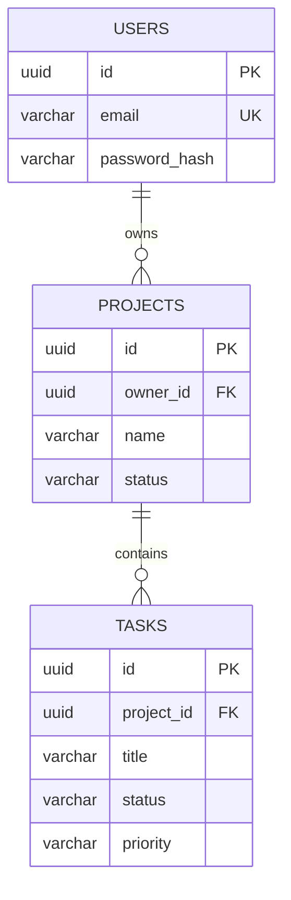
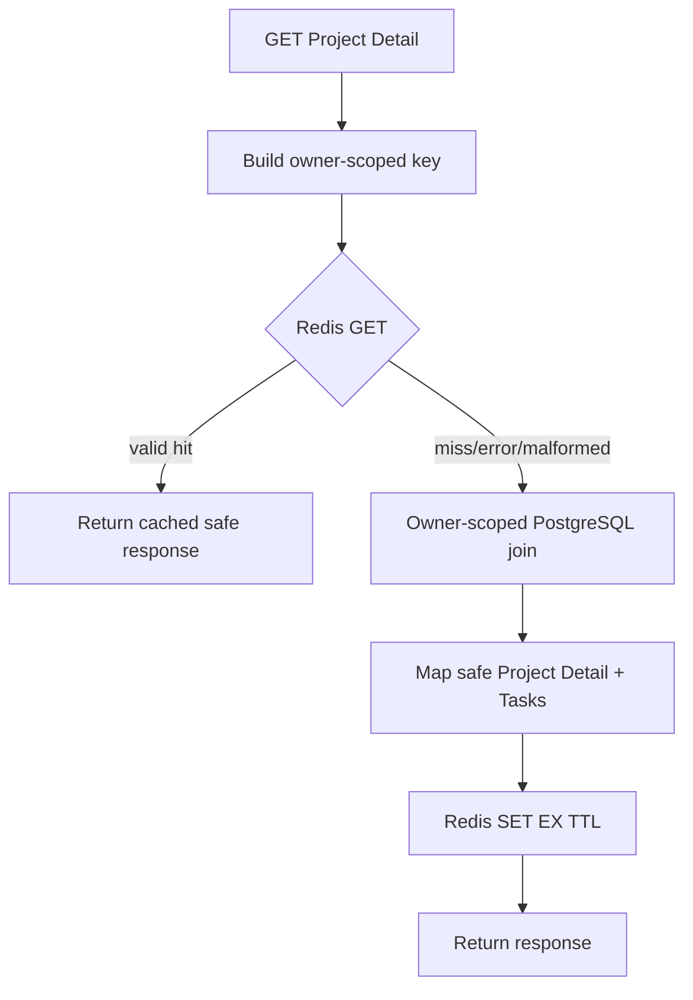
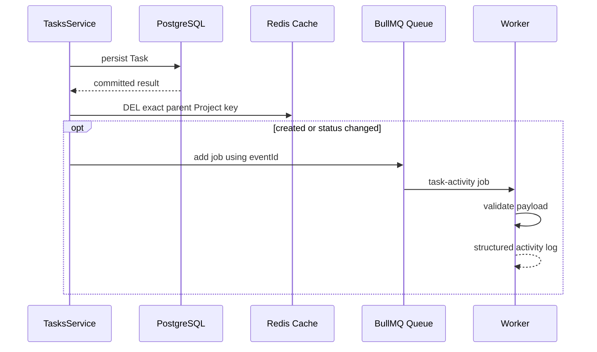

# Ikhtisar Arsitektur

## Tujuan Sistem

Aplikasi menyediakan REST API untuk authentication, Project, dan Task dengan
ownership per pengguna. Sistem dibangun sebagai modular monolith agar batas
domain tetap jelas tanpa menambah kompleksitas jaringan, deployment, dan
konsistensi lintas service yang belum diperlukan.

## Komponen dan Batas Modul



- controller menangani transport dan DTO;
- service menangani aturan bisnis, ownership, invalidasi, dan event;
- repository menangani query TypeORM;
- PostgreSQL menjadi source of truth;
- Redis cache dan BullMQ merupakan kemampuan sekunder;
- common layer menangani validation, error, logging, dan request ID.

## Siklus Request HTTP



Global exception filter memetakan error ke kontrak konsisten. Unexpected error
dicatat secara terstruktur tetapi detail internal tidak dikirim ke client.

## Authentication dan Ownership

Login memverifikasi bcrypt hash dan menerbitkan JWT HS256 dengan UUID pengguna
pada claim `sub`. `JwtAuthGuard` mengisi pengguna terautentikasi sebelum
controller berjalan.

Project selalu dicari menggunakan `projectId` dan `ownerId`. Seluruh operasi
Task lebih dahulu memverifikasi Parent Project milik pengguna. Resource yang
tidak ada atau dimiliki pengguna lain sama-sama menghasilkan `404` untuk
mengurangi enumerasi resource privat.

## Relasi Project dan Task



Project Detail memakai explicit join dengan Tasks dan urutan deterministik.
Penghapusan Project menghapus Tasks melalui foreign key cascade.

## Validation dan Error Contract

Global `ValidationPipe` menggunakan whitelist, menolak unknown property,
melakukan transformasi DTO eksplisit, dan tidak mengaktifkan implicit
conversion global. Error berisi status, code, message, details aman, timestamp,
path, dan request ID.

## Logging dan Request ID

Pino menghasilkan log JSON dengan request ID, method, route template jika
tersedia, status, duration, user ID aman, dan error code. Authorization,
cookie, password, hash, token, serta credential konfigurasi disensor.

`X-Request-ID` dari client hanya diterima jika bounded dan aman; selain itu
UUID baru dibuat. Nilai yang sama digunakan pada log, header, dan error body.

## Project Detail Cache-Aside



Cache hanya membungkus Project Detail. Key menyertakan environment, user ID,
dan project ID. Redis error tidak menggagalkan query PostgreSQL.

## Invalidasi dan Aktivitas Task

Project update/delete serta Task create/update/delete menghapus exact Project
Detail key setelah persistence berhasil.



Queue memakai retry maksimum 3, exponential backoff, bounded retention, dan
event ID sebagai job identity.

## Namespace Redis

Cache menggunakan:

```text
<namespace>:<environment>:cache:project:<userId>:<projectId>
```

BullMQ menggunakan option `prefix`:

```text
<namespace>:<environment>:bull
```

Tidak ada `FLUSHALL`, application `FLUSHDB`, wildcard deletion, atau ioredis
`keyPrefix` untuk BullMQ.

## Health dan Shutdown

`/health` memeriksa liveness proses. `/health/ready` memeriksa PostgreSQL
dengan `SELECT 1`. Redis tidak menjadi dependency readiness karena fiturnya
opsional.

Shutdown hook Nest menutup HTTP server, Worker, QueueEvents, Queue, Redis
clients, listener, timer, logger, dan PostgreSQL pool. Test dengan
`--detectOpenHandles` memastikan proses keluar alami.

## Lapisan Pengujian

- unit test: service, mapper, validation, error, logging, dan konfigurasi;
- E2E: Nest + PostgreSQL + HTTP + authentication nyata;
- integration: Redis cache dan BullMQ nyata;
- Swagger E2E: OpenAPI endpoint dan schema;
- Docker smoke: image, migration, health, auth, Project, Task, dan shutdown.

Coverage global lebih rendah daripada service penting karena unit collection
juga memasukkan DTO decorator, Nest module/bootstrap, entity metadata,
migration, dan code yang terutama divalidasi melalui E2E/integration test.
Coverage gate menjaga baseline nyata tanpa mengecualikan business logic.

## Deployment Container

Docker build memakai stage dependency, build, production dependency, dan
runtime. Runtime hanya membawa compiled application dan production packages,
berjalan sebagai user non-root. Migration dijalankan eksplisit melalui service
`migrate`, bukan saat startup aplikasi.

## Trade-off dan Keterbatasan

- modular monolith dipilih untuk delivery sederhana dan transaksi SQL lokal;
- access token belum memiliki refresh-token rotation;
- throttling bersifat in-memory per instance;
- commit PostgreSQL dan enqueue BullMQ tidak atomik;
- transactional outbox dan distributed tracing belum tersedia;
- tidak ada complex RBAC atau production secret manager;
- cache dan queue memperbaiki operasional, tetapi PostgreSQL tetap source of
  truth.
