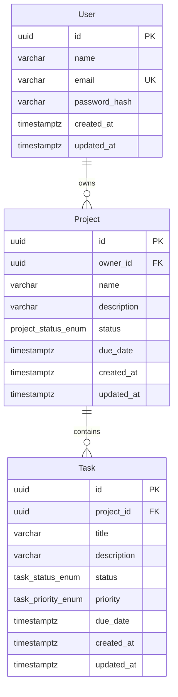

# Skema Database

## Tujuan

Skema PostgreSQL menyediakan fondasi persistence untuk User, Project, dan Task.
Batch ini hanya mendefinisikan struktur data, constraint, migration, dan test
database. Registration, authentication, ownership authorization, dan CRUD
endpoint belum tersedia.

## ERD



Nama tabel aktual adalah `users`, `projects`, dan `tasks`.

## Tabel Users

| Kolom           | Tipe           | Null  | Aturan                                          |
| --------------- | -------------- | ----- | ----------------------------------------------- |
| `id`            | `uuid`         | Tidak | Primary key, dibuat dengan `uuid_generate_v4()` |
| `name`          | `varchar(120)` | Tidak | Nama user                                       |
| `email`         | `varchar(254)` | Tidak | Unique melalui `UQ_users_email`                 |
| `password_hash` | `varchar(255)` | Tidak | Dikecualikan dari class serialization           |
| `created_at`    | `timestamptz`  | Tidak | Default waktu database                          |
| `updated_at`    | `timestamptz`  | Tidak | Dikelola TypeORM saat update                    |

Normalisasi email dan password hashing akan diterapkan pada batch Auth.

## Tabel Projects

| Kolom         | Tipe                  | Null  | Aturan                       |
| ------------- | --------------------- | ----- | ---------------------------- |
| `id`          | `uuid`                | Tidak | Primary key                  |
| `owner_id`    | `uuid`                | Tidak | Foreign key ke `users.id`    |
| `name`        | `varchar(160)`        | Tidak | Nama Project                 |
| `description` | `varchar(2000)`       | Ya    | Deskripsi opsional           |
| `status`      | `project_status_enum` | Tidak | Default `active`             |
| `due_date`    | `timestamptz`         | Ya    | Tenggat opsional             |
| `created_at`  | `timestamptz`         | Tidak | Default waktu database       |
| `updated_at`  | `timestamptz`         | Tidak | Dikelola TypeORM saat update |

Foreign key `FK_projects_owner_id_users_id` menggunakan `ON DELETE RESTRICT`.
User yang masih memiliki Project tidak dapat dihapus.

Index `IDX_projects_owner_id` mendukung listing Project berdasarkan owner.

## Tabel Tasks

| Kolom         | Tipe                 | Null  | Aturan                       |
| ------------- | -------------------- | ----- | ---------------------------- |
| `id`          | `uuid`               | Tidak | Primary key                  |
| `project_id`  | `uuid`               | Tidak | Foreign key ke `projects.id` |
| `title`       | `varchar(200)`       | Tidak | Judul Task                   |
| `description` | `varchar(2000)`      | Ya    | Deskripsi opsional           |
| `status`      | `task_status_enum`   | Tidak | Default `todo`               |
| `priority`    | `task_priority_enum` | Tidak | Default `medium`             |
| `due_date`    | `timestamptz`        | Ya    | Tenggat opsional             |
| `created_at`  | `timestamptz`        | Tidak | Default waktu database       |
| `updated_at`  | `timestamptz`        | Tidak | Dikelola TypeORM saat update |

Foreign key `FK_tasks_project_id_projects_id` menggunakan `ON DELETE CASCADE`.
Menghapus Project menghapus semua Task miliknya pada level database.

Index:

- `IDX_tasks_project_id` mendukung listing Task berdasarkan Project.
- `IDX_tasks_project_id_status` mendukung filter status di dalam satu Project.

## Enum

- `project_status_enum`: `active`, `completed`, `archived`
- `task_status_enum`: `todo`, `in_progress`, `done`
- `task_priority_enum`: `low`, `medium`, `high`

Nilai enum disimpan dalam lowercase dan harus tetap selaras dengan enum
TypeScript.

## Relasi dan Query

Relasi tidak menggunakan eager loading, lazy-loading `Promise`, atau broad
cascade untuk insert dan update. Relasi harus dimuat secara eksplisit oleh
query pada batch fitur berikutnya.

## Migration

Migration awal:

```text
src/database/migrations/1781381812158-InitialSchema.ts
```

`synchronize` dan `migrationsRun` selalu `false`. Perubahan schema harus dibuat
melalui migration yang direview. Migration `down` menghapus object anak sebelum
object induk dan menghapus enum setelah tabel dependennya hilang.

## Isolasi Database

- `DATABASE_NAME` digunakan untuk development.
- `DATABASE_TEST_NAME` digunakan saat `NODE_ENV=test`.
- Validasi gagal jika kedua nama database sama pada test mode.
- Test cleaner memeriksa `current_database()` sebelum menghapus data.
- Cleanup hanya menghapus row dengan urutan `tasks`, `projects`, lalu `users`.
- Tabel metadata migration tidak dihapus.

## Keterbatasan Saat Ini

- Belum ada registration, login, JWT, atau password hashing.
- Belum ada Project dan Task CRUD.
- Belum ada ownership authorization.
- Belum ada soft delete atau audit history.
- Aturan transisi status belum diterapkan.
